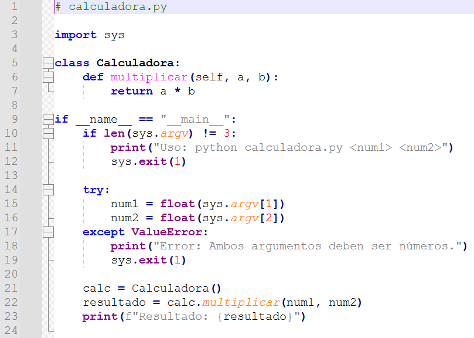
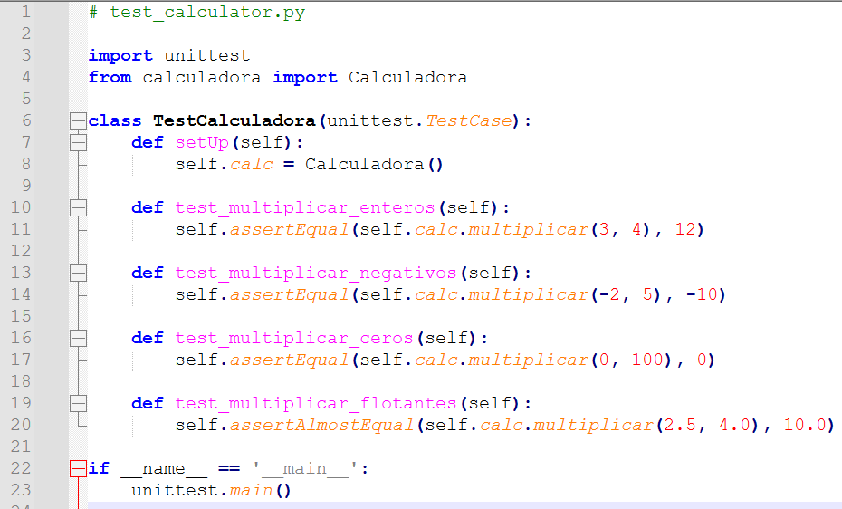
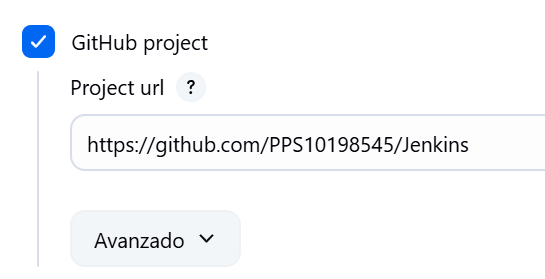
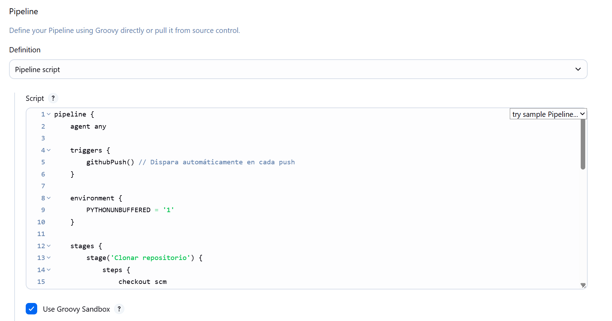

# Proyecto Jenkins con Python - Calculadora

Este proyecto implementa una calculadora en Python que multiplica dos números pasados por la línea de comandos. Además, se configura una canalización de integración continua en Jenkins con pruebas automáticas.

---

## 🧮 Ejercicio 1: Script en Python

Creamos el archivo `calculadora.py` que contiene una clase `Calculadora` con un método `multiplicar`, y que acepta dos argumentos numéricos desde la línea de comandos:



---

## ✅ Ejercicio 2: Pruebas unitarias

El archivo `test_calculator.py` utiliza `unittest` para validar la función `multiplicar` en distintos casos, incluyendo enteros, negativos, ceros y flotantes:



---

## 🚀 Ejercicio 3: Integración continua con Jenkins

Se configura un servidor Jenkins para automatizar la ejecución de los scripts de Python y las pruebas.

### 🌐 Configuración inicial del servidor Jenkins

Establecemos la URL pública del servidor Jenkins:


### 🔗 Enlace al repositorio de GitHub

Se configura Jenkins para que se conecte directamente con el repositorio GitHub del proyecto:



### ⚙️ Jenkinsfile



Se crea un `Jenkinsfile` (o se pega como *Pipeline Script*) con las siguientes etapas:
- Clonación del repositorio.
- Ejecución de la calculadora.
- Ejecución de las pruebas.

```groovy
pipeline {
    agent any

    triggers {
        githubPush()
    }

    stages {
        stage('Clonar repositorio') {
            steps {
                checkout scm
            }
        }

        stage('Ejecutar calculadora') {
            steps {
                sh 'python3 calculadora.py 5 6'
            }
        }

        stage('Pruebas unitarias') {
            steps {
                sh 'python3 -m unittest testCalculator.py'
            }
        }
    }

    post {
        success {
            echo '✅ Todo correcto.'
        }
        failure {
            echo '❌ Algo falló.'
        }
    }
}
